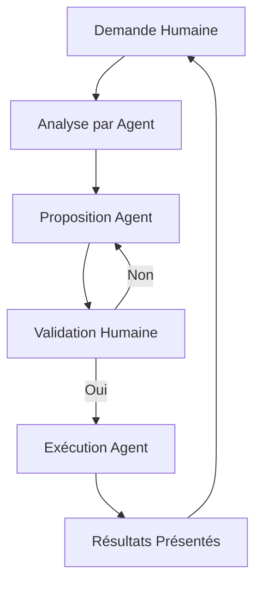

# 👥 Guide de Collaboration Humain-Agent - Boxing Round Splitter

**Objectif** : Ce guide explique comment collaborer efficacement avec l'agent IA pour le développement du projet.

---

## 🤝 Méthode de Travail avec l'Agent IA

### 1. Initialisation de Session

**Processus** :
```
1. Humain → Agent : "Initialise-toi avec [fichiers pertinents]"
2. Agent → Analyse les fichiers et présente des propositions
3. Humain → Valide ou ajuste les propositions
4. Agent → Exécute les actions validées uniquement
```

**Exemple de commande d'initialisation** :
```
"Initialise-toi avec AGENT.md et README.md, puis propose un plan pour [objectif spécifique]"
```

### 2. Cycle de Travail Standard

#### ⚠️ RÈGLE FONDAMENTALE
**L'agent ne fait RIEN sans validation explicite humaine.**

#### Workflow Typique



### 3. Fin de Session

**Processus** :
```
1. Agent → Présente un résumé des actions effectuées
2. Agent → Propose les prochaines étapes
3. Humain → Valide ou demande des ajustements
4. Agent → Documente dans les fichiers STATUS appropriés
```

**Ne JAMAIS** :
- ❌ L'agent ne crée pas de rapports de session sans demande explicite
- ❌ L'agent ne prend pas d'initiatives non validées
- ❌ L'agent ne modifie pas la documentation sans validation

---

## 🗂️ Fichiers Clés pour la Collaboration

### Fichiers de Référence Obligatoires

1. **AGENT.md** - Règles complètes pour l'agent IA
2. **README.md** - Documentation technique du projet
3. **HUMAN.md** - Ce guide (méthode de collaboration)

### Structure de Gestion des Tâches

```
docs/todos/
├── XX_nom_tache.md          # Définition de la tâche
├── XX_nom_tache_STATUS.md   # Suivi de progression
└── 03_current_backlog.md    # Backlog centralisé
```

### Documentation Technique

```
docs/
├── adr/                    # Décisions architecturales
├── architecture/           # Structure globale
├── design/                 # Conception détaillée
└── reports/                # Rapports techniques
```

---

## 📋 Commandes Types pour l'Agent

### Initialisation
```
"Initialise-toi avec [fichiers] et propose un plan pour [objectif]"
```

### Demande d'Analyse
```
"Analyse [problème spécifique] et propose des solutions"
```

### Exécution de Tâches
```
"Exécute [action spécifique] selon le plan validé"
```

### Demande de Rapport (explicite uniquement)
```
"Crée un rapport de session pour [sujet spécifique]"
```

---

## ✅ Checklist de Collaboration

### Avant de Commencer
- [ ] Lire AGENT.md et HUMAN.md
- [ ] Identifier l'objectif clair de la session
- [ ] Préparer les fichiers de référence nécessaires

### Pendant la Session
- [ ] Valider chaque proposition avant exécution
- [ ] Demander des clarifications si nécessaire
- [ ] Documenter les décisions dans les STATUS

### À la Fin
- [ ] Vérifier que tous les fichiers STATUS sont à jour
- [ ] Valider la mise à jour de docs/TIMELINE.md
- [ ] S'assurer que la racine du projet est propre

---

## 🚨 Erreurs Courantes à Éviter

### Côté Humain
- ❌ Donner des instructions ambiguës
- ❌ Oublier de valider les propositions
- ❌ Demander des rapports non nécessaires
- ❌ Ne pas consulter les STATUS avant de commencer

### Côté Agent
- ❌ Prendre des initiatives non validées
- ❌ Créer des rapports de session automatiquement
- ❌ Modifier des fichiers sans validation
- ❌ Exécuter du code sans autorisation

---

## 📊 Bonnes Pratiques

### Pour les Humains
1. **Précision** : Formuler des demandes claires et spécifiques
2. **Validation** : Toujours valider avant exécution
3. **Documentation** : Mettre à jour les STATUS régulièrement
4. **Traçabilité** : Utiliser la timeline pour l'historique

### Pour l'Agent
1. **Analyse** : Toujours analyser avant de proposer
2. **Transparence** : Présenter clairement les options
3. **Prudence** : Ne jamais exécuter sans validation
4. **Traçabilité** : Documenter toutes les actions

---

## 📞 Référence Rapide

| Besoin | Action | Exemple |
|--------|--------|---------|
| Initialiser | `"Initialise-toi avec [fichiers]"` | `"Initialise-toi avec AGENT.md et README.md"` |
| Analyser | `"Analyse [sujet]"` | `"Analyse le problème de détection audio"` |
| Exécuter | `"Exécute [action validée]"` | `"Exécute les tests unitaires"` |
| Rapporter | `"Crée un rapport sur [sujet]"` | `"Crée un rapport sur la migration"` |

---

**Version** : 1.0
**Dernière mise à jour** : 2026-02-16
**Projet** : Boxing Round Splitter

*Respectez ce guide pour une collaboration efficace et sécurisée avec l'agent IA.* 🤖👥