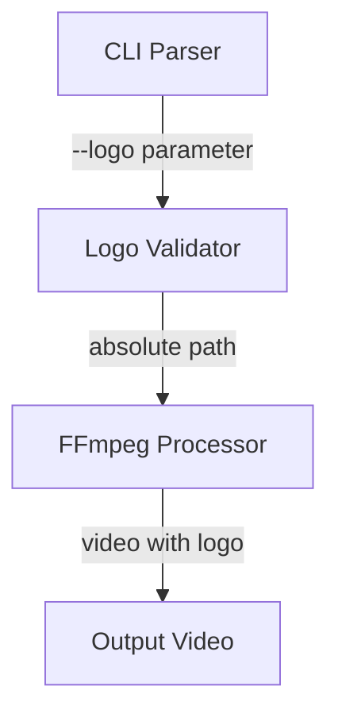
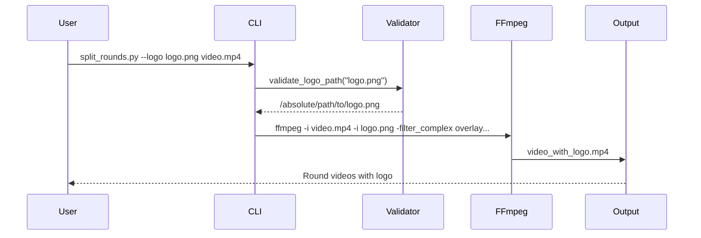

# Logo Support Implementation

## Overview

This document describes the logo overlay feature implementation in the Boxing Round Splitter project, which allows users to add custom branding to output videos.

## Architecture

### Component Diagram



### Key Components

1. **CLI Argument Parser** (`argparse`)
   - Accepts `--logo <path>` parameter
   - Optional parameter with default behavior

2. **Logo Validator** (`validate_logo_path()`)
   - Converts relative paths to absolute
   - Validates file existence
   - Checks supported image formats
   - Provides clear error messages

3. **FFmpeg Integration**
   - Uses `overlay` filter for logo placement
   - Maintains video quality
   - Preserves audio tracks

## Implementation Details

### CLI Parameter

```python
parser.add_argument('--logo', type=str, 
                   help='Path to the logo file to overlay on output videos', 
                   default=None)
```

**Usage Examples**:
```bash
# With custom logo
python split_rounds.py --logo ./my_logo.png video.mp4

# With default logo (logo.png in same directory as script)
python split_rounds.py video.mp4

# No logo (error if default logo not found)
python split_rounds.py --logo none video.mp4
```

### Logo Validation Function

```python
def validate_logo_path(logo_path):
    """
    Validates the logo file path and converts relative paths to absolute paths.
    
    Args:
        logo_path (str): Path to the logo file (can be relative or absolute).
        
    Returns:
        str: Absolute path to the logo file if valid.
        
    Raises:
        FileNotFoundError: If the logo file does not exist.
        ValueError: If the logo file is not a supported image format.
    """
```

**Supported Formats**: `.png`, `.jpg`, `.jpeg`, `.bmp`, `.gif`

### FFmpeg Integration

```python
cmd = [
    "ffmpeg", "-y",
    "-ss", f"{start_time:.3f}",
    "-t", f"{duration:.3f}",
    "-i", input_video,
    "-i", logo_path,  # Logo input
    "-filter_complex",
    f"[0:v]drawtext=text='{creation_date}':fontsize=24:x=10:y=10[text];"
    f"[text][1:v]overlay=W-w-10:10[outv]",  # Overlay logo
    "-map", "[outv]",
    "-map", "0:a?",
    "-c:a", "aac", "-b:a", "48k",
    "-c:v", "libx264",
    "-b:v", "4M",
    "-preset", "fast",
    "-movflags", "+faststart",
    output_file
]
```

**Logo Placement**: Top-right corner (W-w-10:10)
**Size**: Original logo size (no scaling)
**Opacity**: 100% (full opacity)

## Error Handling

### Validation Errors

1. **File Not Found**:
   ```
   FileNotFoundError: Logo file not found: /path/to/logo.png
   ```

2. **Invalid Format**:
   ```
   ValueError: Unsupported logo file format: .svg. Supported formats: png, jpg, jpeg, bmp, gif
   ```

3. **Not a File**:
   ```
   ValueError: Logo path is not a file: /path/to/directory
   ```

### Fallback Behavior

1. **Custom Logo Specified**: Uses the provided logo
2. **No Logo Specified**: Uses `logo.png` from script directory
3. **Default Logo Missing**: Error with clear message
4. **Validation Failure**: Program exits with error code 1

## Performance Considerations

- **Minimal Impact**: Logo overlay adds negligible processing time
- **Memory**: No significant memory overhead
- **Compatibility**: Works with all FFmpeg-supported video formats

## Testing

### Test Cases Covered

1. ✅ Valid PNG logo with relative path
2. ✅ Valid JPG logo with absolute path
3. ✅ Missing logo file (FileNotFoundError)
4. ✅ Unsupported format (.svg)
5. ✅ Directory instead of file
6. ✅ Default logo usage
7. ✅ Logo overlay in output video

### Manual Testing

```bash
# Test with valid logo
python split_rounds.py --logo tests/assets/test_logo.png test_video.mp4

# Test with missing logo (should fail)
python split_rounds.py --logo missing.png test_video.mp4

# Test with default logo
python split_rounds.py test_video.mp4
```

## Usage Examples

### Basic Usage

```bash
# Add custom logo to output videos
python split_rounds.py --logo ./branding/my_logo.png fight_video.mp4

# Output videos will have logo in top-right corner
```

### Advanced Usage

```bash
# Combine with other options
python split_rounds.py --logo ./logo.png --debug fight_video.mp4

# Multiple videos with same logo
python split_rounds.py --logo ./logo.png video1.mp4 video2.mp4 video3.mp4
```

### Logo Requirements

- **Format**: PNG, JPG, JPEG, BMP, or GIF
- **Size**: Recommended 100-300px width for visibility
- **Transparency**: PNG with transparency works best
- **Aspect Ratio**: Preserved (no distortion)
- **Placement**: Fixed at top-right corner

## Troubleshooting

### Common Issues

1. **Logo Not Appearing**:
   - Check FFmpeg logs for overlay errors
   - Verify logo path is correct
   - Ensure logo file is readable

2. **Poor Quality**:
   - Use higher resolution logo
   - Try PNG format with transparency
   - Check original logo quality

3. **Wrong Position**:
   - Currently fixed at top-right
   - Modify FFmpeg filter for different placement

### Debugging

```bash
# Enable debug logging
python split_rounds.py --logo ./logo.png --debug video.mp4

# Check FFmpeg output
journalctl -u ffmpeg  # System logs
ffmpeg -version        # Verify FFmpeg installation
```

## Future Enhancements

### Potential Improvements

1. **Logo Position Options**:
   ```bash
   --logo-position top-left, top-right, bottom-left, bottom-right
   ```

2. **Logo Size Control**:
   ```bash
   --logo-size 150  # Width in pixels
   ```

3. **Logo Opacity**:
   ```bash
   --logo-opacity 0.8  # 0.0 to 1.0
   ```

4. **Multiple Logos**:
   ```bash
   --logo1 logo1.png --logo2 logo2.png
   ```

### Backward Compatibility

All future enhancements should:
- Maintain existing `--logo` parameter behavior
- Add new parameters as optional
- Preserve default logo functionality
- Update documentation accordingly

## Integration with Video Processing

### Processing Flow



### Code Integration Points

1. **CLI Parsing** (`main()` function)
2. **Logo Validation** (before video processing)
3. **FFmpeg Command** (filter_complex with overlay)
4. **Error Handling** (graceful exit on validation failure)

## Best Practices

### Logo Design Recommendations

1. **Contrast**: Ensure logo contrasts with boxing ring colors
2. **Simplicity**: Avoid complex designs that distract from action
3. **Transparency**: Use PNG with alpha channel for best results
4. **Size**: 150-250px width for HD videos
5. **Placement**: Top corners avoid interfering with ring action

### Performance Tips

1. **Pre-validate**: Check logo files before processing multiple videos
2. **Cache Paths**: Store absolute paths to avoid repeated lookups
3. **Batch Processing**: Same logo used for all videos in batch
4. **FFmpeg Optimization**: Use hardware acceleration if available

## Conclusion

The logo support feature provides:
- ✅ Easy branding customization
- ✅ Robust validation and error handling
- ✅ Seamless integration with existing workflow
- ✅ Minimal performance impact
- ✅ Clear documentation and examples

This implementation follows the project's architectural patterns and maintains backward compatibility while adding valuable customization options for users.